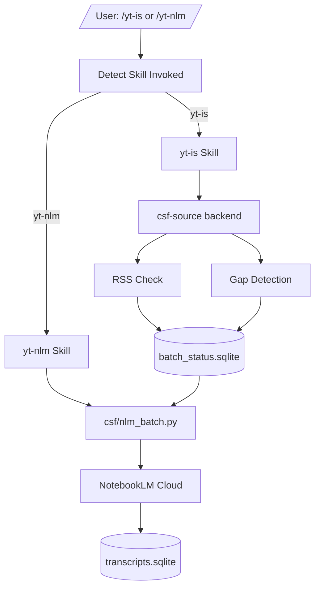

# yt-is — YouTube Intelligence System


YouTube transcript ingestion and analysis pipeline — discover new videos, download transcripts with the full fallback chain (oEmbed → yt-dlp → yt-dlp+cookies → direct API → NotebookLM → Selenium → Whisper), and store results in CKS.

## Documentation Index (read this first)

This README is the entry point. The files below hold the authority for their
respective areas — read them before touching those surfaces. A cold-start
session that reads only this README must be able to find everything load-bearing
from here.

### Workspace state (current session)

- [AGENTS.md](AGENTS.md) — workspace rules for any agent operating in yt-is
- [HANDOFF.md](HANDOFF.md) — current session state and open work streams

### Harness memory and debugging

- [CODEX_MEMORY.md](CODEX_MEMORY.md) — OpenAI Codex harness memory (verified bug fixes, signals that matter, routing caveats). Linked by the codex harness on session start.
- [DEBUGGING_PLAYBOOK.md](DEBUGGING_PLAYBOOK.md) — compact debugging rules, common failure modes, and session-start protocol
- [PLAYBOOK_LINKS.md](PLAYBOOK_LINKS.md) — sub-index of the playbook/memory/handoff trio

### Operations docs (`docs/operations/`)

These are the canonical authority for production behavior. The README does not
duplicate them; it points to them.

- [docs/operations/nlm-auth-architecture.md](docs/operations/nlm-auth-architecture.md) — canonical NLM auth design (single `storage_state.json`, backup repo, preflight, keepalive). Read before touching anything NLM-auth-related.
- [docs/operations/worker-count-trial-run-sheet.md](docs/operations/worker-count-trial-run-sheet.md) — validated throughput numbers (best observed: 3,928 VPH at 4 workers, batch-size 200, Pro tier, worker-owned notebooks)
- [docs/operations/hot-path-throughput-next-test-plan.md](docs/operations/hot-path-throughput-next-test-plan.md) — failure-mode investigations: `source_add_failed`, `rpc_code=9`, NOT_FOUND mapping, zero-growth retry
- [docs/operations/test-registry.md](docs/operations/test-registry.md) — run history and artifacts
- [docs/operations/refactor-plan-2026-07-20-nlm-migration.md](docs/operations/refactor-plan-2026-07-20-nlm-migration.md) — 7-phase nlm-CLI → notebooklm-py migration (Phases 1+2 done, 3–7 deferred)
- [docs/operations/nlm-surface-discovery-2026-07-20.md](docs/operations/nlm-surface-discovery-2026-07-20.md) — inventory of all nlm CLI call sites (baseline for Phases 3–7)

## Production fetch operations (load-bearing)

**Read before launching any production fetch.** Violating these rules has
caused real incidents (scope blowout, mid-run auth death, retrying the wrong
failure mode).

### Scope rule (mandatory)

Never run `bin/csf-source fetch` without `--limit` when the pending backlog
exceeds 1,000 videos. The pending backlog is currently ~51,000 videos; an
unbounded `fetch` will attempt all of them in one run.

To find the intended scope (recent sync batch), use the time-window query:

```sql
SELECT COUNT(*) FROM analysis_status
WHERE status = 'pending'
  AND has_captions IS NULL
  AND updated_at >= strftime('%Y-%m-%dT%H:%M:%SZ', 'now', '-6 days');
```

The current intended scope is **recently synced pending rows** (`has_captions IS NULL`,
meaning not yet categorized), which is approximately 5,700 videos in the last 6
days. Pass `--limit <that count>` at launch time. Recompute before each run —
the window moves.

**Note on `has_captions`:** newly synced videos have `has_captions IS NULL` until
categorization runs; older backlog rows have `has_captions = 0` (already
categorized as no-captions). The scope is the NULLs, not the 0s.

### Validated production configuration

From [worker-count-trial-run-sheet.md](docs/operations/worker-count-trial-run-sheet.md) and [hot-path-throughput-next-test-plan.md](docs/operations/hot-path-throughput-next-test-plan.md):

| Setting | Value | Source |
|---|---|---|
| Worker shape | **3+3** (3 Pro + 3 Free, sharded lanes) | current best sustained: 3,788.53 VPH on `fresh_state_3plus3_extract_schema_primary_command_projection_60_run02_current` (hot-path-throughput-next-test-plan.md:29) |
| Subbatch size | 50 | fixed control; 25 and 75/100 fail at materialization |
| Worker notebooks | One per worker, reused across batches | worker-owned model |
| Pro account | `a.hominidae@gmail.com` | single-account limitation |
| Free accounts | `troup.hominidae`, `brsthomson` | documented but currently unused |
| Auth storage | `P:/.data/yt-is/nlm-auth/storage_state.json` | nlm-auth-architecture.md |

**NOT 4 workers on one account.** The `3,928 VPH at 4 workers` figure from worker-count-trial-run-sheet.md:199 was a single-lane (Pro-only) benchmark candidate, not the validated production shape. The validated shape distributes load across Pro and Free lanes via the benchmark harness `bin/csf-sharded-lane-series`. Applying benchmark-harness config to the production binary was the third of five failures in the 2026-07-20 incident.

**Known gap:** `bin/csf-source fetch` exposes only `--workers` and `--limit`.
It does not expose `--batch-size`; the 50-video subbatch is hardcoded. The
batch-size 200 figure in the trial sheet was validated on the benchmark
harness `bin/csf-sharded-lane-series`, not the production fetcher. Do not
assume production-fetch throughput matches benchmark-harness throughput.

### Known failure modes

| Failure | Symptom | Status | Detail |
|---|---|---|---|
| `source_add_failed` (partial) | Sub-batch returns N/50 added; fetcher continues without reset | By-design (zero-growth retry only fires on 0/50) | hot-path-throughput-next-test-plan.md |
| `rpc_code=9` on ADD_SOURCE | gRPC `FAILED_PRECONDITION` (NOT rate limiting — `RateLimitError` is a different class) | Unresolved; multiple prior investigations (source_map v2–v6) did not pin a single cause | hot-path-throughput-next-test-plan.md |
| Notebook reuse degradation | Failure rate rises as sources accumulate in a reused notebook | Suspected but not confirmed; Pro tier documented at ~300 sources/notebook | worker-count-trial-run-sheet.md |
| Google session expiry | Storage file present but cookies rejected | Observed 2.5h–7.5h lifespan; `ensure_storage()` checks file presence only, not liveness | nlm-auth-architecture.md |

### Smoke test (minimum before any production run)

```powershell
python bin/csf-source fetch --limit 5 --workers 1
```

Expect 4/5 transcripts via NLM in ~42–120 seconds. The 1/5 failure is the
intermittent `rpc_code=9` (see above). A 5-video smoke test **does not**
validate batch-scale behavior; a 400-video run is the minimum that validates
throughput per the trial sheet's Phase 2 protocol.

## Operator Notes

For implementation gotchas, recurring bugs, and lessons learned from live canaries, see [CODEX_MEMORY.md](CODEX_MEMORY.md).

## Quick Start

```powershell
# Check tracked channels for new videos
/yt-is sync

# Industrial Ingest (NLM Batch) - BEST FOR BACKLOG (worker-count dependent; benchmark sweep continues through 8 workers)
/yt-nlm

# Surgical Fetch (full transcript fallback chain)
/yt-is fetch
```

## Installation

### Three Deployment Models

**IMPORTANT**: This package supports three different deployment modes. Choose the right one for your use case.

#### 1. SKILLS (Dev Deployment) ⭐ **Recommended for Development**

**For**: When you're actively developing this package and want instant feedback.

**Setup:**
```powershell
# Windows (Junction - No admin required)
New-Item -ItemType Junction -Path "$CLAUDE_ROOT/skills\yt-is" -Target "$CLAUDE_ROOT/skills\yt-is"
New-Item -ItemType Junction -Path "$CLAUDE_ROOT/skills\yt-nlm" -Target "$CLAUDE_ROOT/skills\yt-nlm"
```

**Key points:**
- Skills are in `P://.claude/skills/yt-is/` and `P://.claude/skills/yt-nlm/`
- Changes to skill files take effect immediately
- No reinstallation required

#### 2. SYMLINK (CLI Tools)

**For**: When you want `yt-is` and `csf-source` commands available in your terminal.

**Setup:**
```powershell
# Symlink bin tools to a directory in your PATH
cmd /c "mklink P://bin/yt-is $CLAUDE_PLUGIN_ROOT/bin\yt-is"
cmd /c "mklink P://bin/csf-source $CLAUDE_PLUGIN_ROOT/bin\csf-source"
```

**Key points:**
- `yt-is` — channel management (sync, list, add, fetch)
- `csf-source` — backend for channel and transcript operations
- Both commands share the same SQLite database

#### 3. PLUGINS (End User Deployment)

**For**: Distributing this package to other users via marketplace or GitHub.

**Setup:**
```bash
# End users install via /plugin command
/plugin P://packages/yt-is

# Or from marketplace (when published)
/plugin install yt-is
```

## Skills

### `/yt-is` — YouTube Channel Management

Check all tracked YouTube channels for new videos and manage your channel list.

**Commands:**
- `sync` — Check all tracked channels for new videos
- `list` — List all tracked channels with metadata
- `add <url>` — Add a new channel or playlist to track
- `fetch` — Download transcripts for all pending videos using the full fallback chain

**Escalation Chain (per video):**
1. **yt-dlp (WEB client)** — Fastest (~5 seconds), works for most public videos
2. **yt-dlp with cookies** — For age-restricted videos
3. **Selenium Firefox** — Fallback for bot-check failures (~15-30 seconds)

### `/yt-nlm` — NotebookLM Transcript Extraction

Extract YouTube transcripts using NotebookLM's batch notebook workflow.

**Recommended approach:** Worker-owned batch notebooks (one notebook per worker title, reused across batches; batch size 200) — uses `nlm source content` (raw text), has auth auto-recovery built in.

**Auth contract for tests:** `nlm login` covers the CLI path only. The DOM/spinner readiness path uses a separate persistent Chrome profile and must be bootstrapped once with a signed-in browser session before DOM tests will work. Benchmark-owned lane Chrome may be closed at any time to reset browser state before a rerun; that cleanup should only target the lane roots under `P:\.data\yt-is\browser\notebooklm-pro` and `P:\.data\yt-is\browser\notebooklm-free`, not user-owned Chrome or Comet sessions. yt-is also refreshes the NotebookLM CLI itself with `uv tool install --upgrade notebooklm-mcp-cli` unless `YTIS_NLM_AUTO_UPDATE=0`, then probes `nlm login --check` and falls back to the known-good pinned git spec via `YTIS_NLM_FALLBACK_SPEC` if the latest release breaks login on this machine.

**Old approach (deprecated):** Ephemeral notebooks — one notebook per video, slow, wastes NotebookLM slots.

## CLI Tools

### `yt-is`

Channel management CLI wrapping `csf-source`.

```powershell
yt-is sync                  # Check all tracked channels for new videos
yt-is list                  # List all tracked channels
yt-is add <url>             # Add a new channel to track
yt-is fetch                 # Download pending transcripts (full fallback chain)
yt-is fetch --dry-run       # Preview what would be fetched
yt-is fetch --source <url>  # Process only one channel
yt-is fetch --workers 2     # Use 2 parallel workers
```

### `csf-source`

Backend implementation for channel and transcript operations.

```powershell
csf-source list              # List all tracked sources
csf-source add <url>         # Add a new source
csf-source check <source>    # Check one source for new videos
csf-source check-all         # Check all sources for new videos
csf-source sync <source>     # Process pending videos for a source
csf-source fetch             # Download pending transcripts
csf-source fetch --dry-run   # Preview what would be fetched
```

## Pipeline Overview

```
/yt-is sync
    ↓
RSS check → Gap detection → API resolution
    ↓
batch_status.sqlite (pending videos)
    ↓
/yt-nlm (Industrial Cloud Ingest) —— [PRIMARY: 99% Signal SNR]
    ↓ OR
/yt-is fetch (Surgical Local) —— [FALLBACK: 40% Signal SNR]
    ↓
transcripts.sqlite (Provenance-tracked Clean Store)
    ↓
Combined markdown batches → CKS / Obsidian / analysis tools
```

## Data Flow

```
channel_metadata table (SQLite)
    │
    ├─► yt-is sync ──► RSS check ──► Gap detection ──► API resolution
    │                                                │
    │                                                ▼
    │                                       batch_status table (pending)
    │
    ├─► yt-is fetch ──► FULL FALLBACK CHAIN ──► transcripts.sqlite
    │
    └─► /yt-nlm ──► Batch notebooks ──► nlm source content ──► transcripts.sqlite
```

## Storage

- **batch_status.sqlite** — Channel metadata and video tracking
  - `channel_metadata` — tracked channels with playlist IDs
  - `analysis_status` — video status (pending/complete/failed), last_stage, failure_reason
- **transcripts.sqlite** — Cached transcripts keyed by video_id

## Environment Variables

| Variable | Required | Description |
|----------|----------|-------------|
| `YOUTUBE_API_KEY` | For gap resolution | YouTube Data API v3 key for filling RSS gaps |
| `NLM_AUTH_TOKEN` | For NotebookLM | NotebookLM session token |
| `NLM_PROJECT_ID` | For NotebookLM | GCP project ID for NotebookLM |
| `YTIS_SCAN_STATUS_INTERVAL_S` | Optional | Emit scan status heartbeats this often during `/yt-is sync` and `csf-source fetch` scans (default: 30) |

## Development

### Requirements

- Python 3.12+
- `yt-dlp>=2024.0.0`
- `nlm` CLI (NotebookLM command-line interface, auto-refreshed by yt-is via `uv tool install --upgrade notebooklm-mcp-cli` with a pinned fallback if the latest build fails login)
- Firefox (for Selenium fallback)

### Key Files

```
yt-is/
├── bin/
│   ├── yt-is               # Channel management CLI
│   └── csf-source          # Backend implementation
├── csf/
│   ├── transcript.py        # Transcript fetching (yt-dlp, NLM)
│   ├── batch_status.py      # SQLite storage for video tracking
│   ├── source_enumerator.py  # RSS + API enumeration
│   └── cache.py             # Transcript caching
└── skills/
    ├── yt-is/SKILL.md        # Channel management
    ├── yt-nlm/SKILL.md       # NotebookLM batch extraction
    └── yt-dlp/SKILL.md       # Local yt-dlp transcript fetching
```

## Architecture



---

**Key features:**
- Automatic full fallback chain for transcript download
- Batch NotebookLM workflow with shared defaults in `csf/nlm_config.py` (`notebook_batch_size = 50`, `notebook_source_cap = 50`) and one notebook per worker title
- Auth auto-recovery for NotebookLM sessions
- Configurable NotebookLM policy via `csf/nlm_config.py` and the `YTIS_NLM_*` env vars it reads
- External transcript provider hook for custom sources
- Multi-terminal safe batch processing with InterProcessLock
- See [PLAYBOOK_LINKS.md](PLAYBOOK_LINKS.md) for the debugging playbook, handoff, and memory pointers.
